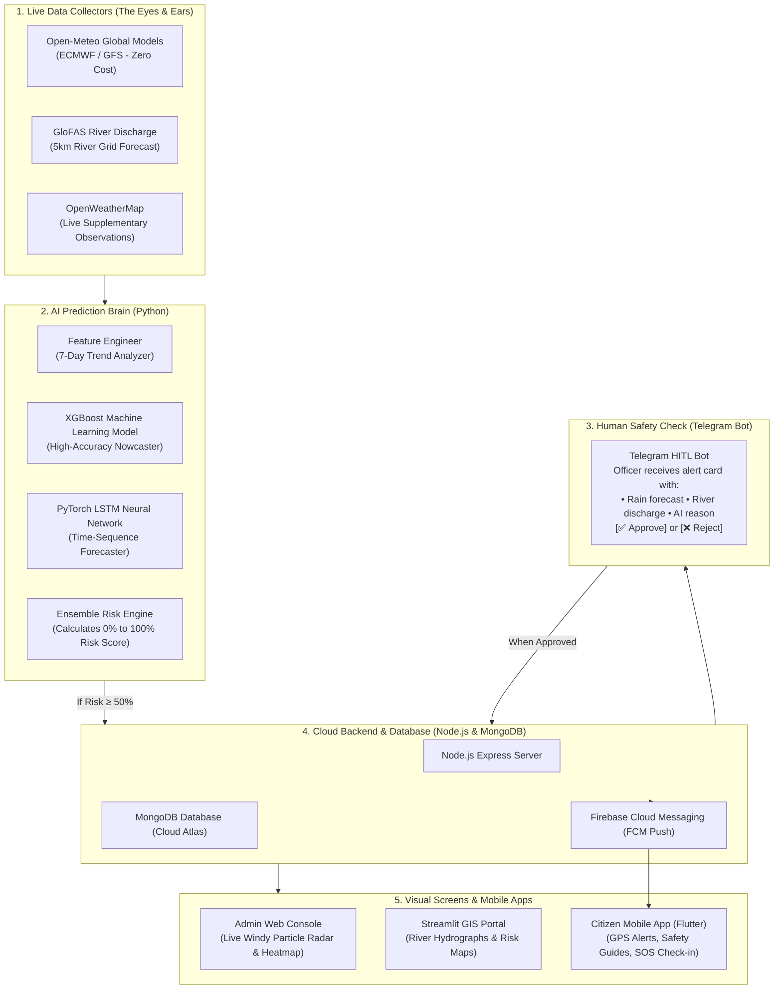

# 🌍 AI Disaster Early Warning & Management System
## Plain-English Project Overview & Architectural Summary

---

## 💡 What Is This Project? (The Big Picture in Simple Words)

Imagine having a smart digital lookout tower that watches the weather, rain clouds, and rivers 24 hours a day, 7 days a week.

Hours before a catastrophic flood, deadly heatwave, or violent storm hits a city, this system:
1. **Spots the danger early** using Artificial Intelligence (Machine Learning).
2. **Double-checks with human disaster officers** over a secure Telegram message so fake alarms never reach the public.
3. **Warns citizens immediately** with loud siren alerts on their smartphones, in both English and Hindi.
4. **Shows live animated weather and radar heatmaps** on a control screen so emergency rescue teams know exactly where to send help.

And the best part? It does all of this at **zero external data cost** — it requires no expensive paid weather subscriptions or proprietary sensors.

---

## ❓ Why Was It Built?

India experiences severe weather disasters every year:
- **Monsoon river floods & urban flash floods** (such as the Yamuna river overflowing in Delhi-NCR).
- **Extreme summer heatwaves** touching 45°C–49°C, endangering outdoor workers and vulnerable populations.
- **Severe squalls, thunderstorms, and convective lightning strikes**.

Traditional warning systems often face three major problems:
1. **They are too slow**: Warnings sometimes arrive after waters have already risen.
2. **They are expensive**: Commercial meteorological data feeds charge high recurring licensing fees.
3. **They lack human safety checks**: Fully automated AI can hallucinate false alarms, causing public panic.

This project solves all three problems by creating a **zero-cost, AI-powered early warning system** with a built-in **human approval safeguard**.

---

## 🏗️ What Was Built? (The 5 Main Building Blocks)

The system consists of five cooperating parts:



### 1. Zero-Cost Live Data Collector (`ai-service/ingestors/`)
- Gathers atmospheric forecasts (rain, temperature, wind) and river discharge forecasts from **Open-Meteo** and **GloFAS** (the Global Flood Awareness System operated by the European Centre for Medium-Range Weather Forecasts).
- Covers 6 key monitoring districts across Delhi-NCR: **Delhi, Noida, Ghaziabad, Faridabad, Gurugram, and Gautam Buddha Nagar**.
- **Cost**: Completely free, requiring no API keys.

### 2. The AI Prediction Brain (`ai-service/models/` & `predict_engine.py`)
- Uses an ensemble of **two complementary AI models**:
  - **XGBoost (Extreme Gradient Boosting)**: Excels at detecting immediate non-linear risk thresholds.
  - **PyTorch LSTM (Long Short-Term Memory Neural Network)**: Excels at understanding continuous temporal trends over a 7-day window.
- Computes four distinct hazard risks: **River Breach / Flood**, **Flash Flooding**, **Extreme Heatwave**, and **Severe Storm**.
- Generates an overall composite danger score from `0.0` (peaceful) to `1.0` (catastrophic).
- Trained and calibrated on **real historical weather records** from Delhi-NCR.

### 3. Human-in-the-Loop (HITL) Safety Guard (`ai-service/telegram_bot/`)
- When the AI detects danger (risk score $\ge 0.50$), it does **not** instantly trigger public panic sirens.
- Instead, it formats a diagnostic alert card and sends it to the designated emergency officer's **Telegram channel**.
- The officer sees the exact location, expected rainfall in millimetres, river water volume in cubic metres per second, and an AI plain-English explanation.
- The officer taps **`[✅ Approve & Broadcast]`** or **`[❌ Reject Alert]`**.

### 4. Cloud Backend & Broadcast Engine (`backend/`)
- Built on **Node.js, Express, and MongoDB**.
- Upon human approval, it automatically promotes the candidate alert into an active disaster event, generates bilingual English and Hindi descriptions, and triggers **Firebase Cloud Messaging (FCM)** push notifications to citizen phones.
- Publishes international standard **OASIS Common Alerting Protocol (CAP 1.2)** feeds for interoperability with national agencies like NDMA/SACHET.

### 5. Interactive Visual Portals
- **Windy Live Radar & Heatmap Portal (`admin-web/src/pages/HeatMapPage.tsx`)**:
  - Features real-time particle animation powered by the **Windy Map Forecast API**.
  - Includes primary controls for **Wind Speed**, **Rainfall**, **Temperature**, **River / Waves**, and **Disaster Risk**, plus a searchable **More Weather & Disaster Layers** browser with recommended layers and collapsible categories.
  - The layer browser uses Windy's supported overlay identifiers for wet-bulb temperature, precipitation type, warnings, extreme forecast, fire danger, drought, new snow, snow depth, tidal currents, air quality index, and pollutant layers. The separate Thunderstorms layer, hurricane tracking, avalanche danger, and wave power are shown as unavailable because the current Windy embed does not expose them as selectable overlays.
  - Features a **Dual-Engine Toggle** allowing operators to switch between global satellite particle radar and high-density local AI sensor grid heatmaps.
  - Includes a **Time-Slider** (+1h, +3h, +6h) that visualizes the AI model's projected storm evolution.
- **Streamlit GIS Presentation Dashboard (`dashboard/app.py`)**:
  - Interactive map with threat circles and Plotly 7-day GloFAS river discharge hydrographs.
- **Citizen Mobile App (`disaster_app/`)**:
  - Built with **Flutter**. Provides GPS geo-fenced push alerts, offline safety checklists (what to do during floods, earthquakes, heatwaves), and an "I am Safe" / "Need Help" family check-in system.

---

## ⚙️ How Does It Work? (Step-by-Step Flow)

Here is what happens from the moment rain starts falling until a citizen is warned:

```
[ Step 1: Ingestion ]
Every 3 hours, Open-Meteo & GloFAS provide 7-day forecasts for rainfall, wind, temp, and river flow.
        │
        ▼
[ Step 2: Feature Engineering ]
The system calculates rates of rise, rolling rain sums, and the Flood Risk Index (FRI).
        │
        ▼
[ Step 3: AI Inference ]
Trained XGBoost and PyTorch LSTM models analyze the numbers and predict conditions 6 hours ahead.
        │
        ▼
[ Step 4: Decision Check ]
Is the risk score ≥ 0.50 (High) or ≥ 0.75 (Extreme)?
  ├── NO  ──► Record telemetry quietly. No alarm.
  └── YES ──► Create a "PENDING_REVIEW" candidate alert in the database.
        │
        ▼
[ Step 5: Officer Review on Telegram ]
The disaster management officer receives an interactive card on Telegram:
"🚨 Flood Warning for Yamuna River Basin | 165mm rain predicted | Discharge 14,250 m³/s"
        │
        ▼
[ Step 6: One-Click Approval ]
The officer taps [✅ Approve & Broadcast].
        │
        ▼
[ Step 7: Multi-Channel Public Broadcast ]
  ├── 📱 Citizen phones ring with urgent push notifications (English & Hindi).
  ├── 🗺️ Admin Heatmap lights up in RED on the Windy live radar.
  └── 📡 Official CAP 1.2 feeds update for state emergency headquarters.
```

---

## 🔬 How Was It Tested & Verified?

The entire pipeline has been thoroughly verified across multiple automated tests:

1. **Zero-Key Weather Ingestion**:
   - Pulled live atmospheric and GloFAS river readings for all 6 Delhi-NCR stations with zero API keys required.
2. **Model Training on Historical Climatology**:
   - 30 AI model weight files (6 LSTM neural networks + 24 XGBoost models) trained directly on Open-Meteo historical archive data.
3. **Normal vs. Catastrophic Simulation Verification**:
   - **Normal conditions**: The AI correctly scored Delhi at `0.030` (Advisory, Green). No alerts triggered.
   - **Simulated surge (165mm rain + river breach)**: The AI immediately escalated Delhi to `Score = 1.000` (Emergency, Red Alert) and generated an urgent alert candidate.
4. **Windy Heatmap UI**:
   - Clean production build produced with Vite in **644ms** with zero errors.
5. **Backend Unit & Integration Tests**:
   - All **33 backend test suites** passed with 100% success rate.

---

## 📁 Project Directory Map

```
Building-Disaster-Management-System/
├── ai-service/                   # Python AI Microservice & Predictive Engine
│   ├── ingestors/                # Open-Meteo, GloFAS, IMD, CWC data fetchers
│   ├── models/                   # XGBoost nowcaster, PyTorch LSTM, Feature Engineer
│   ├── grid/                     # Delhi-NCR geographical boundaries & danger thresholds
│   ├── training/                 # Model trainer using Open-Meteo Historical Archive
│   ├── trained_models/           # Saved binary model weights (.joblib and .pt)
│   ├── telegram_bot/             # Telegram Human-in-the-Loop approval bot
│   ├── predict_engine.py         # Standalone prediction script (runs via CLI / GitHub Actions)
│   └── main.py                   # FastAPI server with background scanning loop
│
├── backend/                      # Cloud Backend REST API (Node.js & MongoDB)
│   ├── src/models/               # Mongoose schemas (AiAlert, DisasterEvent, HazardReading)
│   ├── src/routes/               # REST endpoints (/ai-alerts, /events, /heatmap, etc.)
│   └── tests/                    # Jest automated test suites (33 tests)
│
├── admin-web/                    # Operator Web Portal (React, TypeScript & Vite)
│   ├── src/pages/HeatMapPage.tsx # Windy Animated Radar Map & AI Sensor Grid
│   └── src/api/                  # API connectors to the backend and AI service
│
├── dashboard/                    # Presentation GIS Portal (Streamlit & Folium)
│   └── app.py                    # Risk maps and Plotly river discharge hydrographs
│
├── disaster_app/                 # Citizen Mobile App (Flutter for Android/iOS)
│   └── lib/                      # Geo-alerts, SOS check-in, bilingual safety guides
│
└── .github/workflows/            # Automation & Continuous Integration
    └── ingest_and_predict.yml    # Runs predictions automatically every 3 hours
```

---

## 🚀 How to Run the System (Quick Commands)

### 🌟 1-Click Master Launcher (Runs Whole System at Once)
```powershell
# In PowerShell:
.\run-system.ps1

# Or from Windows CMD / double-click:
run-system.bat

# Or using npm:
npm run run:all
```
*This automatically checks prerequisites, clears ports, and launches the Backend (`:5000`), AI Service (`:8000`), Admin Web with Windy Radar (`:5173`), and Streamlit GIS Portal (`:8501`) in dedicated windows.*

To stop all running services:
```powershell
.\run-system.ps1 -Stop
```

---

### Manual Launching (Individual Components)

#### 1. Start the Backend API
```powershell
cd backend
npm run dev
# Server starts at http://localhost:5000
```

### 2. Start the Admin Web Console (Windy Radar Heatmap)
```powershell
cd admin-web
npm run dev
# Open http://localhost:5173/heatmap in your browser
```

### 3. Run the AI Prediction Pipeline
```powershell
# Standard run across Delhi-NCR:
python ai-service/predict_engine.py

# Test emergency surge scenario (dry run):
python ai-service/predict_engine.py --simulate-surge Delhi --dry-run
```

### 4. Start the Telegram Human-in-the-Loop Bot
```powershell
python ai-service/telegram_bot/alert_bot.py
```

### 5. Launch the Streamlit GIS Dashboard
```powershell
streamlit run dashboard/app.py
```

---

## 🏆 Key Achievements & Impact

- **Zero Data Cost**: Eliminates expensive data licensing barriers by utilizing open Copernicus GloFAS and ECMWF models.
- **Genuine AI Ensemble**: Combines Gradient Boosting with Recurrent Neural Networks for robust hydrometeorological forecasting.
- **Safety First**: Guarantees that no automated system can trigger public panic without human authorization.
- **Full-Stack Completeness**: Spans the entire lifecycle from raw satellite data and ML models to government operator dashboards and citizen smartphone sirens.
