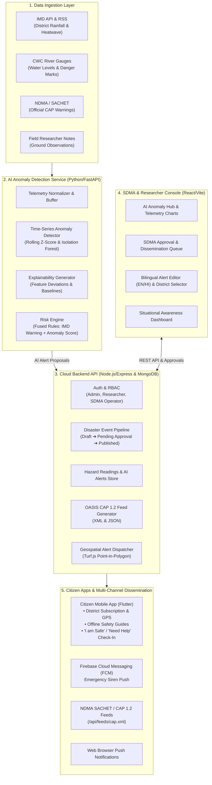

# 🇮🇳 India Disaster Management & AI Early Warning System

An intelligent, cloud-native disaster early-warning and situational awareness platform engineered for Indian hazard management (IMD, CWC, NDMA/SACHET standards).

The platform continuously ingests environmental telemetry, applies unsupervised time-series anomaly detection to identify emerging threats (heavy rainfall, flash floods, heatwaves, river gauge danger marks), guides human researchers and State Disaster Management Authority (SDMA) operators through a verifiable approval workflow, and rapidly disseminates alerts across mobile apps (FCM), browser push feeds, and OASIS CAP 1.2 compliant feeds.

---

## 🏛️ System Architecture



---

## 📦 Project Structure

```
Building-Disaster-Management-System/
├── backend/                  # Node.js + Express + Mongoose API
│   ├── src/
│   │   ├── models/           # Mongoose schemas (DisasterEvent, HazardReading, AiAlert, CitizenCheckIn, ...)
│   │   ├── routes/           # REST endpoints (events, aiAlerts, hazardReadings, citizens, capFeeds, ...)
│   │   ├── services/         # alertService (Turf.js geo-containment, FCM push, retractions)
│   │   ├── middleware/       # JWT auth, role validation, rate limiters
│   │   └── server.js         # Entry point
│   ├── Dockerfile            # Container configuration
│   └── package.json
│
├── ai-service/               # Python 3.13 + FastAPI AI Anomaly Microservice
│   ├── ingestors/            # IMD, CWC river gauge, and SACHET ingestors
│   ├── models/               # Time-series anomaly detection & explainability
│   ├── engine/               # Rule-based risk fusion matrix
│   ├── main.py               # FastAPI server and background scheduler
│   └── requirements.txt
│
├── admin-web/                # React 19 + TypeScript + Vite Admin Console
│   ├── src/
│   │   ├── pages/            # AI Hub, Situational Awareness, Event Approval, New Event, Guides
│   │   ├── components/       # Leaflet interactive map, Layout, Charts
│   │   └── api/              # Typed Axios API client
│   └── public/
│       └── browser-alerts.html # Live CAP browser notification subscriber
│
├── disaster_app/             # Flutter 3.x Cross-Platform Citizen App
│   ├── lib/
│   │   ├── core/             # API client, offline SQLite/SharedPreferences cache, audio buzzer
│   │   └── features/         # Alert dashboard, 1-tap "I'm Safe", Offline Guides, Map, Settings
│   └── pubspec.yaml
│
└── docker-compose.yml        # Multi-service local & cloud orchestration
```

---

## 🚨 Indian Hazard Taxonomy & Severity Standards

The system adheres to Indian Disaster Management Authority standards:

### Hazard Categories
- **Meteorological / Hydrological**: Flood, Flash Flood, Heavy Rainfall, Urban Waterlogging, Cyclone, Heatwave, Coldwave, Drought.
- **Geological**: Earthquake, Landslide, Tsunami.
- **Industrial / Technological**: Chemical Spill, Fire, Gas Leakage.

### Severity Matrix
| Severity | NDMA Color | Criteria | Action & Sound |
| :--- | :--- | :--- | :--- |
| **Advisory** | 🟡 Yellow | Early warning, monitor updates | Standard push, silent notice |
| **Watch** | 🟠 Orange | Significant risk expected, prepare | High priority notification |
| **Warning** | 🔴 Red | High danger to life/property | Severe vibration + alert chime |
| **Emergency** | 🟣 Dark Red | Imminent catastrophe / evacuation | Full-screen modal + continuous siren buzzer |

---

## 🔄 SDMA Event Approval Lifecycle

1. **AI Discovery or Researcher Draft**:
   - The AI Anomaly service detects abnormal rainfall/river surge &rarr; creates an `AiAlert` in `pending_review`.
   - Researchers inspect telemetry and click **"Promote to Disaster Event"** (creates a `draft` or `pending_approval` event).
2. **SDMA Operator Review**:
   - SDMA officers review the target district, polygon geofence, and bilingual advisories (English & Hindi).
   - Upon clicking **Approve & Dispatch**, status updates to `published`.
3. **Instant Dissemination**:
   - Turf.js computes points-in-polygon for registered citizens in the targeted district/coordinates.
   - Multicast FCM pushes siren alerts to devices.
   - OASIS CAP 1.2 XML/JSON feeds are updated dynamically at `/api/feeds/cap.xml`.
4. **Citizen Situational Awareness**:
   - Citizens tap **"I am Safe"** or **"Need Help"**.
   - Responses stream into the **Situational Awareness Dashboard** for disaster response team coordination.

---

## 🛠️ Quick Start & Running All Services At Once

You can run the entire stack at once using any of the following methods:

### Option A: Unified Terminal (Single Command)
Run from the root directory to launch the Backend, AI Engine, and Admin Console simultaneously in one terminal:
```bash
npm start
```

### Option B: 1-Click Multi-Window Startup (Windows Recommended)
Spawns each service in its own dedicated, labeled terminal window so you can view individual logs:
- **PowerShell**:
  ```powershell
  .\start-all.ps1
  ```
- **Command Prompt / File Explorer**:
  Double-click `start-all.bat` or run:
  ```cmd
  start-all.bat
  ```

### Option C: Docker Compose (Full Container Stack)
```bash
docker-compose up --build
```

---

### Running the Citizen Mobile App (Flutter)
Launch in a new terminal once an Android Emulator, iOS Simulator, or physical device is connected:
```bash
cd disaster_app
flutter run
```

---

### Individual Service Manual Commands (Optional)
| Component | Directory | Command | Port |
| :--- | :--- | :--- | :--- |
| **Cloud Backend API** | `cd backend` | `npm run dev` | `http://localhost:5000` |
| **AI Anomaly Microservice** | `cd ai-service` | `python main.py` | `http://localhost:8000` |
| **SDMA Admin Web Portal** | `cd admin-web` | `npm run dev` | `http://localhost:5173` |
| **Citizen Flutter App** | `cd disaster_app` | `flutter run` | Mobile / Web / Desktop |


---

## 📜 OASIS CAP 1.2 Feed Integration
- **XML Feed**: `GET http://localhost:5000/api/feeds/cap.xml`
- **JSON Feed**: `GET http://localhost:5000/api/feeds/cap.json`
- **Live Browser Subscriber**: Open `http://localhost:5173/browser-alerts.html` to receive real-time web notifications.
